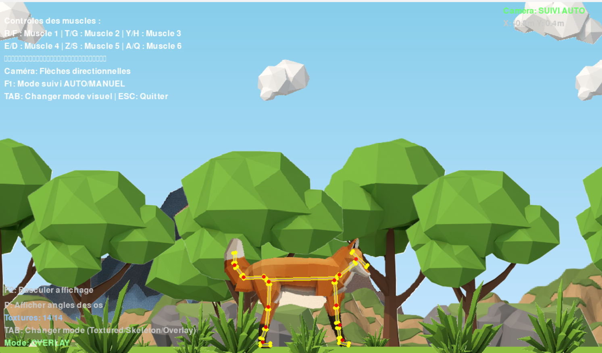

# 🦊 Quadruped Muscle Simulation with Genetic Algorithm AI


<p align="center">
  
</p>

## 📝 Project Description
This project simulates a **quadruped fox** with a full muscle-bone skeleton built on top of **Box2D** physics and **Pygame** rendering. The creature has **8 controllable muscles** distributed across the four legs, and it learns to walk through a **genetic algorithm** — no hardcoded gait, no neural network, just evolution of action sequences over generations 🦊

It was built to explore how far a pure **evolutionary approach** (genome = sequence of muscle actions) can go on a non-trivial locomotion task, and to play with **muscle-based physics**, **parallax backgrounds**, and **per-bone textures** along the way.

---

## ⚙️ Features

  🦴 Full skeleton with **14 bones** (body, legs, neck, head, tail) connected by **13 revolute joints**

  💪 **8 controllable muscles** (4 legs × 2 joints), each with `contract` / `extend` / `relax` actions

  🧬 **Genetic Algorithm** with tournament selection, elitism, single-point crossover and per-gene mutation

  ⏱️ **Adaptive genome length** — the time limit grows automatically as the population gets better

  📊 Full **CSV logging** per generation (fitness, distance, stability, energy, muscle usage %, duration)

  🖼️ **Parallax background** with clouds, mountains, hills, trees and bushes for a nice look

  🦊 **Per-bone fox texture** overlay (head, neck, body, thighs, shins, ankles, feet, tail segments)

  🎮 **Two modes**: human control (keyboard) or autonomous AI training

  ⚡ **Fast mode** (`F2`) — disable rendering to run training up to 50× faster

  💾 Save / load via `pickle` + automatic training summary across multiple runs

---

## Example Outputs

<p align="center">
  
</p>

Each training run logs detailed statistics in `data/training_data.csv`:

| Metric              | Description                                                |
|---------------------|------------------------------------------------------------|
| `fitness_best`      | Best fitness reached in the generation                     |
| `distance_best`     | Furthest distance walked (in meters)                       |
| `stability_avg`     | Fraction of individuals that did not flip                  |
| `energy_avg`        | Average number of muscle activations used                  |
| `usage_muscleX_*`   | Per-muscle usage % (contract vs. extend) across the gen    |

### 📝 Notes & Observations
- Early generations mostly **fall on their back** — the `fallen_penalty` quickly filters them out.
- After ~20 generations, individuals start producing **rhythmic muscle patterns** even though nothing in the genome encodes rhythm explicitly.
- The **adaptive time limit** is important: keeping it short at the start avoids wasting frames on broken individuals.

---

## ⚙️ How it works

  🦊 The quadruped is a Box2D body made of **14 rigid bones** linked by **revolute joints with motors** — each motor is a "muscle".

  🧬 Each individual has a **genome of N frames** (e.g. 500), and each gene is one of **17 actions** (8 muscles × 2 directions + `do nothing`).

  🎯 At each frame, the agent reads `genome[frame]` and sends `contract` / `extend` / `relax` to the corresponding muscle.

  🏆 The **fitness** combines distance walked, stability bonus (or fall penalty), small energy penalty and time-alive bonus.

  🥊 **Tournament selection** picks parents (size 3), with the top `elite_size` individuals carried over unchanged.

  ✂️ **Single-point crossover** mixes two parents, then **per-gene mutation** flips genes with probability `mutation_rate`.

  ⏳ The **time limit grows adaptively** — once the best individual walks farther than 1 m, frames are added so the AI can keep optimizing longer trajectories.

  💾 Population, best individual and training counter are saved every `save_every` generations and reloaded automatically at startup.

---

## 🗺️ Architecture Diagram

The training loop follows a classic **Genetic Algorithm** pipeline applied to a fixed-length action sequence:

```
                ┌────────────────────────────────────────────────┐
                │   Initial population (50 random genomes)        │
                │   genome = [a0, a1, ..., a499]   aᵢ ∈ [0..16]   │
                └──────────────────────┬──────────────────────────┘
                                       │
                                       ▼
        ┌──────────────────────────────────────────────────────────┐
        │  For each individual:                                     │
        │    • Reset Box2D world + quadruped                        │
        │    • Replay genome frame-by-frame on the 8 muscles        │
        │    • Track distance, stability, energy, time_alive        │
        │    • fitness = w₁·dist + w₂·stab − w₃·energy + w₄·time    │
        └──────────────────────┬───────────────────────────────────┘
                               │
                               ▼
            ┌───────────────────────────────────────────┐
            │  Tournament selection (size = 3)          │
            │  + Elitism (top elite_size kept as-is)    │
            └────────────────────┬──────────────────────┘
                                 │
                                 ▼
              ┌──────────────────────────────────────┐
              │  Single-point crossover (rate 0.7)   │
              │  Per-gene mutation (rate 0.1)        │
              └────────────────────┬─────────────────┘
                                   │
                                   ▼
              ┌──────────────────────────────────────┐
              │  New generation → loop back          │
              │  + Adaptive time limit update        │
              │  + CSV stats + pickle save           │
              └──────────────────────────────────────┘
```

**Key hyperparameters** (see [config_ia.py](config_ia.py)):
- `population_size = 50`
- `genome_length = 500` (adaptive, up to `max_time = 2000`)
- `mutation_rate = 0.1`
- `crossover_rate = 0.7`
- `elite_size = 5`
- `num_actions = 17` (8 muscles × {contract, extend} + 1 idle)

---

## 📂 Repository structure
```bash
├── img/                                  # Textures (fox parts, backgrounds, parallax)
│   ├── fox_texture_*.png                 # Per-bone textures (head, body, legs, tail)
│   ├── hill*.png, mountain2.png          # Parallax layers
│   ├── cloud*.png, tree*.png, bush*.png  # More parallax decoration
│
├── asset/
│   └── logo_simulation_Quadruped_AI.png  # Project logo
│
├── data/                                 # Saved models + per-generation CSV stats
│   ├── fox_ai.pkl
│   ├── training_data.csv
│   └── training_summary.csv
│
├── training1/ training2/ training3/      # Snapshots of previous training runs
│
├── main.py                               # Main loop (Pygame + Box2D + IA glue)
├── physics.py                            # Box2D world, Bone, Muscle, Quadruped
├── display.py                            # Pygame rendering + camera (follow / manual)
├── overlay.py                            # Per-bone fox texture overlay
├── parallax.py                           # Parallax background manager
├── ia_gen.py                             # GeneticAlgorithm + AIController
├── config_ia.py                          # All training hyperparameters
│
├── LICENSE
└── README.md
```

---

## 💻 Run it on Your PC
Clone the repository and install dependencies:
```bash
git clone https://github.com/Thibault-GAREL/Quadruped-Muscle-simulation-AI.git
cd Quadruped-Muscle-simulation-AI

python -m venv .venv # if you don't have a virtual environment
source .venv/bin/activate   # Linux / macOS
.venv\Scripts\activate      # Windows

pip install box2d pygame numpy pandas

python main.py
```

### 🎮 Play it yourself
Set `HUMAN_CONTROL = True` in [config_ia.py](config_ia.py), then launch `python main.py`.

| Key            | Action                              |
|----------------|-------------------------------------|
| `T` / `G`      | Muscle 0 contract / extend          |
| `Y` / `H`      | Muscle 1 contract / extend          |
| `U` / `J`      | Muscle 2 contract / extend          |
| `I` / `K`      | Muscle 3 contract / extend          |
| `R` / `F`      | Muscle 4 contract / extend          |
| `E` / `D`      | Muscle 5 contract / extend          |
| `Z` / `S`      | Muscle 6 contract / extend          |
| `A` / `Q`      | Muscle 7 contract / extend          |
| `Arrows`       | Move the camera (manual mode)       |
| `F1`           | Toggle camera follow mode           |
| `F2`           | Toggle rendering (fast training)    |
| `TAB`          | Switch overlay mode                 |
| `P`            | Show bone angles                    |
| `ESC`          | Quit                                |

### 🤖 Train the AI
Set `HUMAN_CONTROL = False` and tune `GA_CONFIG` / `TRAINING_CONFIG` / `FITNESS_CONFIG` in [config_ia.py](config_ia.py), then:
```bash
python main.py
```
Disable rendering with `DISPLAY_ENABLED = False` (or press `F2` at runtime) to train ~50× faster. Press `S` during training to save manually.

---

## 📖 Inspiration / Sources
I code it without any help 😆 !

Inspired by my fascination for **muscle-based locomotion** and **evolutionary robotics** — wanted to see how far a pure genetic algorithm could push a Box2D quadruped without any neural network or hand-crafted gait.

Code created by me 😎, Thibault GAREL - [Github](https://github.com/Thibault-GAREL)
